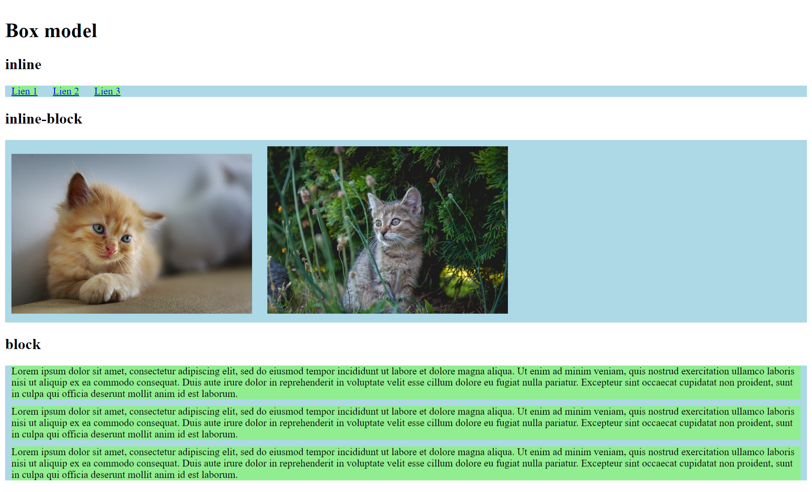

# CSS

## Exercice 10: marges

### Enoncé

 1. Utiliser les propriétés de marge sur un élément de type bloc ("block box") possédant une bordure:
    - Marges internes (padding)
    - Marges externes (margin)
 2. Tester les mêmes propriétés de marge sur un élément de type en ligne par défaut ("inline box") possédant une bordure.

### Exemples

#### Block box
 
 1. Centrer un `body` possédant une largeur maximum inférieure à la largeur de l'écran.
 2. Ajouter une marge externe uniquement entre chaque article.
 3. Ajouter une marge interne dans chaque article.

#### Inline box

 1. Ajouter une marge interne sur les liens du menu de navigation.

[Corrections (v9)](./corrections)

### Remarques théoriques

#### Plusieurs positions par déclaration

Les propriétés raccourcies `margin` et `padding` peuvent accueillir plusieurs valeurs en fonction des positions.
   1. Si 1 seule valeur est présente, elle s'applique communément aux positions `top`, `right`, `bottom`, `left`.
   2. Si 2 valeurs sont présentes:
      1. La première s'applique aux positions `top` et `bottom`.
      2. La seconde s'applique aux positions `right` et `left`.
   3. Si 3 valeurs sont présentes:
      1. La première s'applique à la position `top`.
      2. La deuxième s'applique aux positions `right` et `left`.
      3. La troisième s'applique à la position `bottom`.
   4. Si 4 valeurs sont présentes:
      1. La première s'applique à la position `top`.
      2. La deuxième s'applique aux positions `right`.
      3. La troisième s'applique à la position `bottom`.
      4. La quatrième s'applique à la position `left`.

#### Box model et dimensions d'affichage

Pour rappel, les marges influent sur les dimensions d'affichage, selon le modèle de boîte CSS.

#### Fusion des marges

A noter que, pour les éléments "inline", la marge du haut (`margin-top`) et la marge du bas (`margin-top`) ne s'appliquent jamais.

A noter que, pour les éléments "block" contenus dans un élément sans padding, la marge du haut (`margin-top`) du premier élément et la marge du bas (`margin-top`) du dernier élément ne s'appliquent pas.

A noter que, dans le cadre du flux normal d'affichage, si deux éléments adjacents possèdent tous deux une marge externe (`margin`) se touchant l'une et l'autre, seule la marge la plus importante des deux sera prise en considération. Deux marges ne s'aditionnent donc pas. Attention toutefois que, techniquement, les deux marges sont toujours présentes: elles ne font que se chevaucher dans l'affichage final. (Voir [MDN docs - Fusion des marges](https://developer.mozilla.org/fr/docs/Web/CSS/CSS_Box_Model/Mastering_margin_collapsing))

##### Exemple

Sur ce exemple, seuls les éléments en vert possèdent une marge de 10px.

