# Validation de compétences


Récréez la page web suivante:

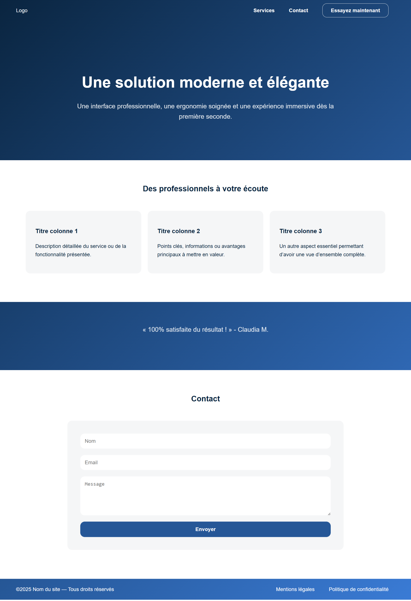

Voici la charte graphique de base:

```css
:root {
    --font-family: Arial;
    --color-light: #ffffff;
    --color-dark: #265797;
    --color-darker: #0a2540;
    --color-accent: #f5f6f7;
}

```


## Etape 1: Header

 1. Créez votre document HTML avec un header contenant le texte "Logo" et le menu de navigation principal.
 
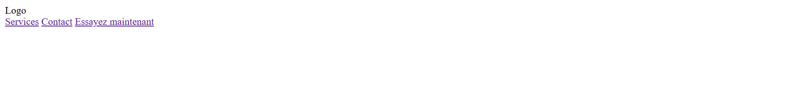

 2. Spécifiez le css de la page: la police de caratères, la couleur du texte, ainsi qu'un dégradé de couleur sur toute la page. Les liens ne sont pas soulignés.

 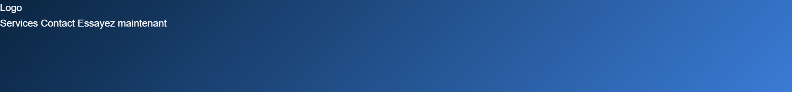

 3. Le header possède une marge interne. Les liens dans le header sont en gras. Les liens du menu possèdent une marge externe latérale.

 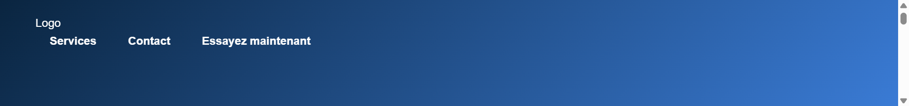

 4. On dispose le contenu du header selon deux colonnes, ces deux colonnes étant automatiquement séparées par un espace.

 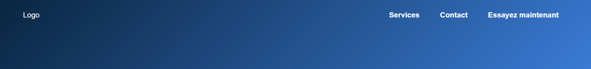

 5. On rajoute une classe au dernier lien pour lui donner une apparence de bouton.

 

 6. On gère le bouton au survol. Vous pouvez aussi préciser une transition de style.

 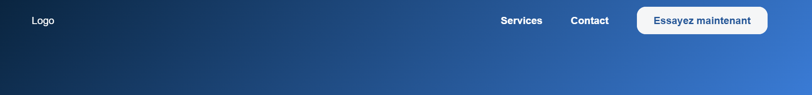


## Etape 2: Section de présentation

 1. On rajoute une section contenant un titre principal et un paragraphe. Cette section possède une largeur maximale de 800 pixels (ce qui permet d'avoir le retour à la ligne dans le paragraphe). Il faudra se tourner vers une astuce des marges pour centrer la section. On veille à appliquer les bons espacements verticaux.
 
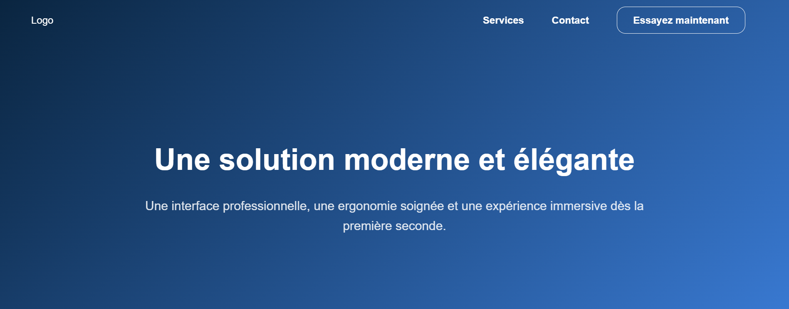

## Etape 3: Section de contenu principal

 1. On rajoute une section au fond clair contenant un titre secondaire, ansi que trois conteneurs au fond un peu foncé possédant des sous-titres et des paragraphes.
 
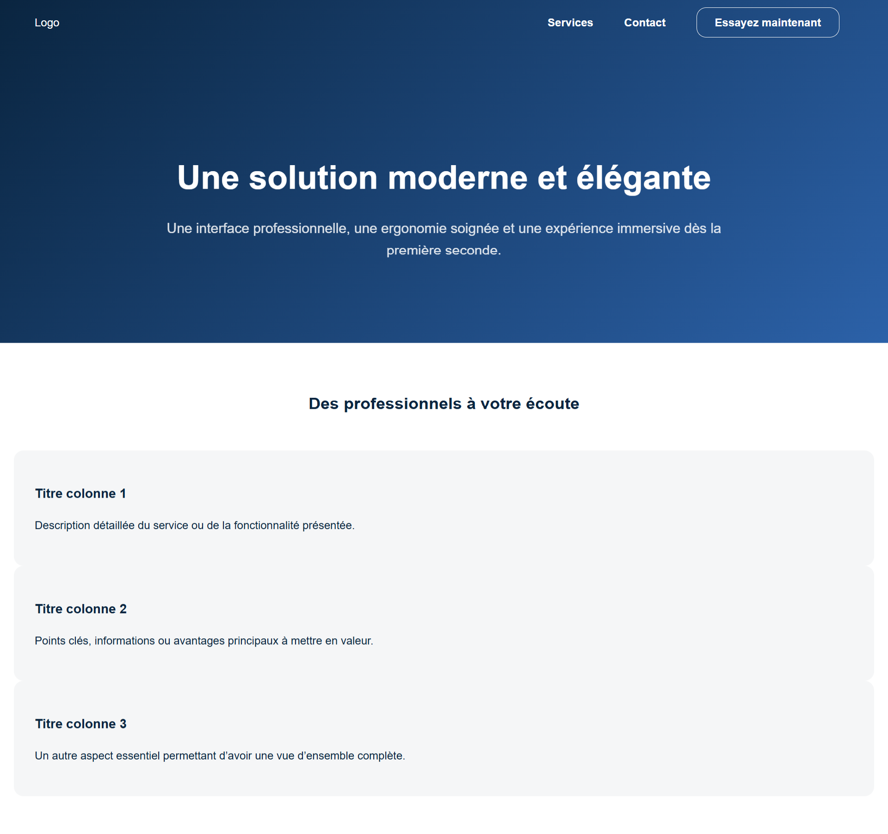

 2. On dispose les conteneurs en colonnes centrées et de même largeur.
 
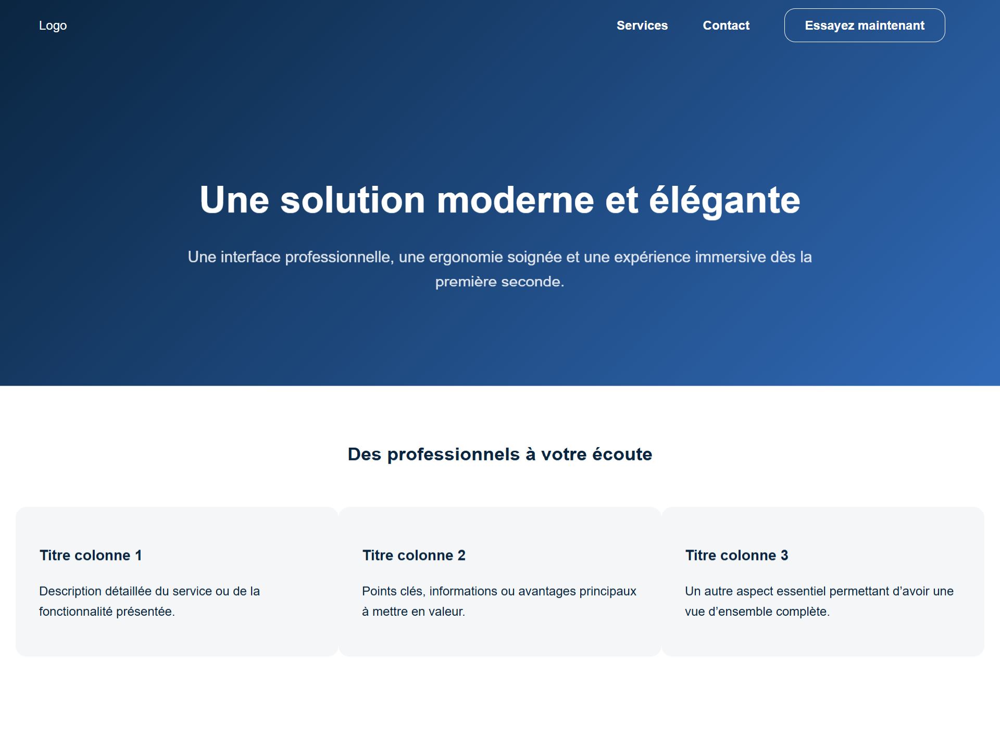

 3. On flanque les colonnes d'une marge externe latérale. On peut éventuellement restreindre leur largeur maximale (ex: 300 pixels).
 


## Etape 4: Section de transition

 1. On rajoute une section (sans fond clair) contenant un paragraphe.
 
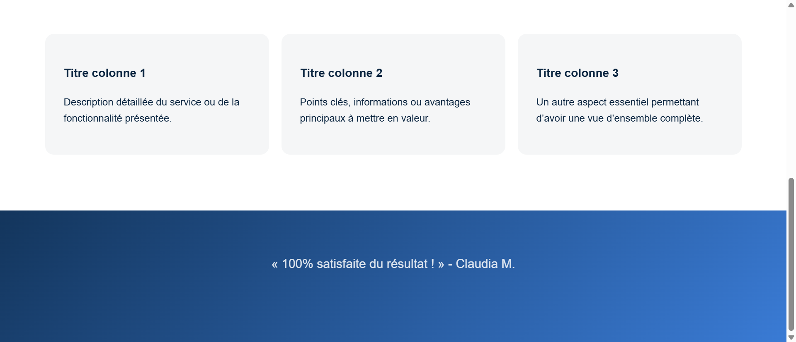

## Etape 5: Section de contact

 1. On rajoute une section au fond clair contenant un titre secondaire et le formulaire de contact. Le formulaire est limité à 800 pixels de large maximum et possède un fond un peu plus foncé.
 
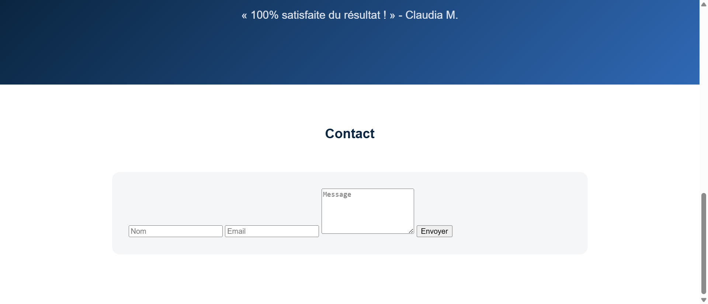

 2. On dispose les champs les uns en dessous des autres. On utilisera pour cela une fonctionnalité spécifique des flexbox.
 
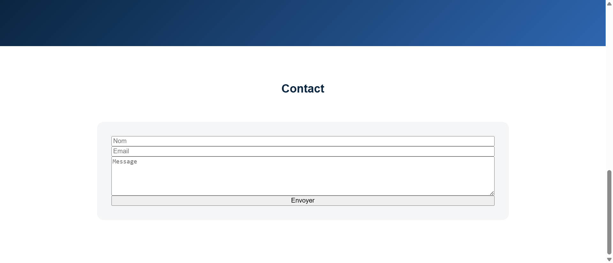

 3. On modifie le style des champs, notament leurs propriétés de boîte (marges internes, marges externes, pas de bordure).
 
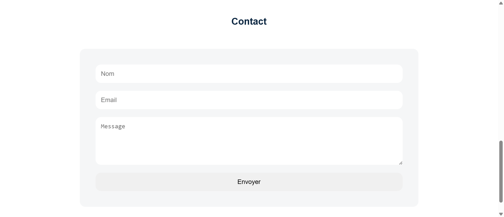

 4. On rajoute une classe sur le bouton de soumission.
 
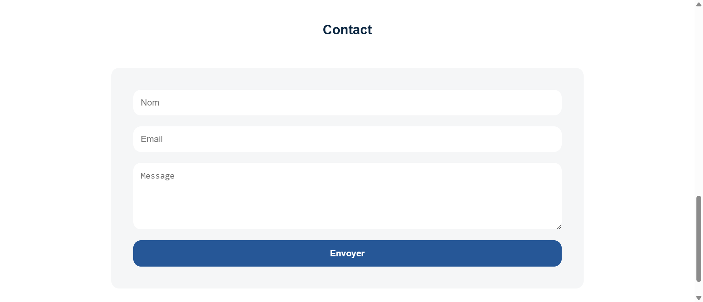

## Etape 6: Footer

 1. En se basant sur le header, on rajoute un footer avec un menu de navigation secondaire dont les liens ne sont pas en gras.
 
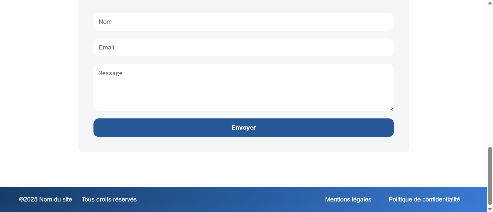


