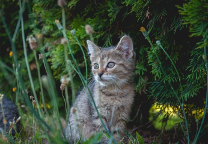

# Changements

 1. Ajout d'images dans le dossier `images`.
 2. Ajout des balises d'image, dans `/index.html`:
     - `img` ([MDN docs - image](https://developer.mozilla.org/fr/docs/Web/HTML/Element/Img))

```html

``` 
 3. Ajout des balises d'image, dans `/blog/index.html`:
     - `img` ([MDN docs - image](https://developer.mozilla.org/fr/docs/Web/HTML/Element/Img))

 ```html

``` 
A noter l'utilisation du symbole `../` pour remonter dans le répertoire parent.
